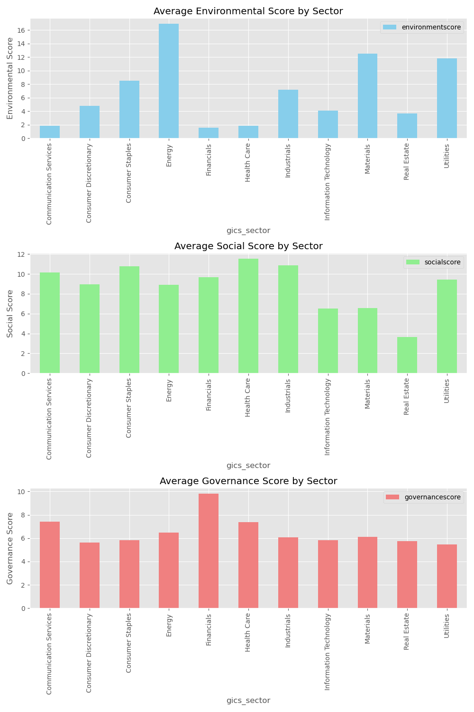

# S&P 500 ESG Sector Analysis

## Project Overview
This project analyzes the Environmental, Social, and Governance (ESG) scores for various sectors within the S&P 500. The goal is to determine which sectors are putting more effort into green initiatives, social responsibility, and good governance practices.

## Objectives
- **Compare average ESG scores** by sector, including environmental, social, and governance components.
- **Identify patterns** to understand how high-impact sectors like energy are addressing sustainability.

## Data
- **Source**: S&P 500 ESG data and price data obtained from Kaggle.
- **Files Used**:
  - `sp500_esg_data.csv`: ESG scores of S&P 500 companies.
  - `sp500_price_data.csv`: Historical price data of S&P 500 companies.

## Tools and Libraries
- **Python**
- **Pandas** for data manipulation
- **Matplotlib** and **Seaborn** for data visualization

## Steps Involved
1. **Data Cleaning**: Removing duplicates, fixing data types, and standardizing column names.
2. **Exploratory Analysis**: Grouping ESG scores by sector and calculating average scores.
3. **Visualization**: Created bar charts to compare Environmental, Social, and Governance scores by sector.

## How to Run the Project
1. Clone the repository:
    ```bash
    git clone https://github.com/eminzey/esg-sector-analysis.git
    ```
2. Install the necessary dependencies:
    ```bash
    pip install -r requirements.txt
    ```
3. Run the Jupyter Notebook or Python script to view the analysis.

## Key Insights
1. **Energy Sector**: The Energy sector has the highest average environmental score, highlighting its significant environmental impact. Despite this, the sector also boasts a relatively high total ESG score, which suggests considerable efforts in governance and social responsibility, demonstrating a balanced approach.
2. **Information Technology Sector**: The Information Technology sector has relatively low environmental and social scores, indicating limited focus on these aspects compared to other sectors. This may imply that tech companies are not yet prioritizing environmental and social initiatives at the same level as others, despite being some of the most valuable companies in the world.
3. **Consumer Staples and Utilities**: Consumer Staples and Utilities sectors have high total ESG scores, reflecting their commitment to balanced efforts across environmental, social, and governance initiatives. These sectors are leading the way in adopting responsible practices across the board.
4. **Health Care Sector**: The Health Care sector places a strong emphasis on social responsibility and governance, indicating significant efforts toward fair practices and societal impact. This focus makes health care companies stand out in their commitment to societal well-being.
5. **Real Estate Sector**: The Real Estate sector has relatively low total ESG scores, suggesting fewer initiatives compared to other sectors. This indicates room for growth and improvement in adopting more sustainable and responsible practices.

## Visualization


## Author
- **Aman Mebrahtu** - Aspiring Data Scientist eager to apply data analysis and visualization skills.

## License
This project is licensed under the MIT License.

## Contact
If you have any questions or suggestions, feel free to reach out via email at [ematewie@gmail.com](mailto:ematewie@gmail.com).


